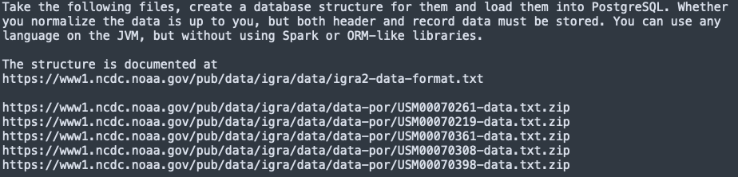
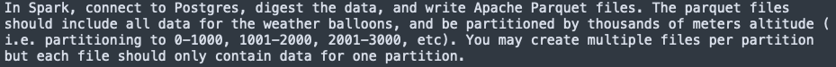

# Given tasks
## Part 1

## Part 2

# Solution
## Required software
1. JDK 11
2. maven
3. sbt
4. docker
5. docker-compose

## Applications
To build applications you need:
1. In the root folder execute: `mvn package` and copy the package into the folder apps/dataloader.
2. In the folder reader execute:`sbt package` and copy the package into the folder apps.
3. Copy PostgreSQL JDBC driver into the folder apps.

## Data
Copy input files (zip) into output folder (`./data/input`).

## Prepare image
Execute: `docker build -t cluster-apache-spark:3.0.2`

## Start Spark cluster
Execute: `docker-compose up -d`

## Run applications
1. Connect to spark-master terminal and execute:
`cd /opt/apps/dataloader && java -cp ./dataloader-1.0.jar:/opt/apps/postgresql-42.2.22.jar com.github.terentich.adjust.dataloader.Main /opt/data/input ./db.properties`
2. Submit spark app:
`/opt/spark/bin/spark-submit --deploy-mode client --master spark://spark-master:7077 --conf spark.db.url=jdbc:postgresql://database:5432/ --conf spark.db.user=postgres --conf spark.db.password=password1234 --conf spark.data.output=/opt/data/output --total-executor-cores 1 --class com.github.terentich.adjust.pipeline.Main --driver-memory 2G --executor-memory 6G --jars /opt/apps/postgresql-42.2.22.jar /opt/apps/adjust-reader_2.12-1.0.jar`